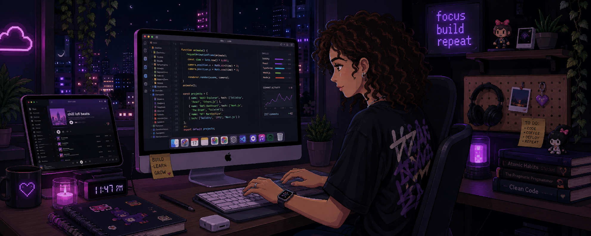

<!-- ========================================================= -->
<!--                  ROCHITA GUDE | GITHUB                   -->
<!-- ========================================================= -->

<!-- ========================================================= -->
<!--              ANIMATED PURPLE HEADER                      -->
<!-- ========================================================= -->

 

<!-- ========================================================= -->
<!--                    INTRO                                  -->
<!-- ========================================================= -->

<h1>
  👋 Hey, I'm Rochita Gude
</h1>

<h2>
  <code>Computer Science (Data Science) Undergraduate</code>
</h2>

  <b>Software Developer</b>
  &nbsp; | &nbsp;
  <b>AI Explorer</b>
  &nbsp; | &nbsp;
  <b>Data Science Enthusiast</b>

 

<!-- ========================================================= -->
<!--                    CODING GIF                             -->
<!-- ========================================================= -->

  

---

# 🧑‍💻 About Me

I'm a **Computer Science undergraduate specializing in Data Science**
at **VNR VJIET**, passionate about building intelligent,
practical and visually engaging software.

  

💻 Building full-stack and AI-powered applications

  

🤖 Exploring Machine Learning and intelligent systems

  

📊 Interested in Data Analytics and Visualization

  

🌐 Developing modern web applications

  

🧩 Practicing Data Structures & Algorithms

  

🚀 Always learning, building and experimenting

---

# ⚡ What I Work On

<table>
<tr>

<td width="33%" align="center">

## 💻 Software

`C++`

`Python`

`Java`

`JavaScript`

`DSA`

`OOP`

`DBMS`

</td>

<td width="33%" align="center">

## 🤖 AI & Data

`Machine Learning`

`Data Science`

`EDA`

`NLP`

`Computer Vision`

`RAG`

`Agentic AI`

</td>

<td width="33%" align="center">

## 🌐 Development

`React`

`Next.js`

`Node.js`

`REST APIs`

`FastAPI`

`MongoDB`

`MySQL`

</td>

</tr>
</table>

---

# 🛠️ Tech Stack

### 💻 Languages

  

`SQL` • `R`

  

### 🌐 Frontend

  

### ⚙️ Backend

  

### 🗄️ Databases

  

### 🤖 AI / Data Science

  

`Machine Learning`
&nbsp; • &nbsp;
`Data Preprocessing`
&nbsp; • &nbsp;
`EDA`

 

`Computer Vision`
&nbsp; • &nbsp;
`NLP`
&nbsp; • &nbsp;
`RAG`
&nbsp; • &nbsp;
`Agentic AI`

  

### 🔧 Tools

  

`Google Colab`
&nbsp; • &nbsp;
`Tableau`
&nbsp; • &nbsp;
`Power BI`
&nbsp; • &nbsp;
`n8n`

---

# 🚀 Featured Projects

<table>

<tr>

<td width="50%" valign="top">

<h2>😴 SleepSense</h2>

<h3>AI Productivity & Fatigue Monitoring</h3>

A computer-vision based productivity system that detects
when a user is falling asleep while working.

 

<b>Features</b>

  

👁️ Eye-state detection

 

🚨 Fatigue alerts

 

⏱️ Productivity monitoring

 

🔔 Alarm system

 

📊 Session tracking

  

<b>Tech Stack</b>

  

<code>Python</code>
<code>OpenCV</code>
<code>MediaPipe</code>
<code>NumPy</code>
<code>Pygame</code>

  

</td>

<td width="50%" valign="top">

<h2>🛡️ Cyber Threat Dashboard</h2>

<h3>Real-Time Cybersecurity Monitoring</h3>

A cybersecurity dashboard designed to visualize threats,
security alerts, network activity and cyber intelligence.

 

<b>Features</b>

  

🔐 Threat monitoring

 

📊 Data visualization

 

🚨 Security alerts

 

🌐 Network insights

 

📈 Interactive dashboard

  

<b>Tech Stack</b>

  

<code>React.js</code>
<code>JavaScript</code>
<code>Data Visualization</code>

  

</td>

</tr>

<tr>

<td width="50%" valign="top">

<h2>🤖 AI Resume Screening</h2>

<h3>Candidate Screening & Shortlisting</h3>

An AI-powered application designed to analyze resumes
and assist with automated candidate screening.

 

<b>Tech Stack</b>

  

<code>Python</code>
<code>Machine Learning</code>
<code>NLP</code>

  

</td>

<td width="50%" valign="top">

<h2>🧠 Autonomous Fraud Investigation</h2>

<h3>Agentic RAG & Graph Intelligence</h3>

An intelligent fraud investigation system combining
agentic workflows, RAG, graph intelligence and
event-driven automation.

 

<b>Tech Stack</b>

  

<code>Python</code>
<code>LangGraph</code>
<code>RAG</code>

 

<code>FAISS</code>
<code>Neo4j</code>
<code>n8n</code>

  

</td>

</tr>

</table>

---

# 📊 GitHub Analytics

  

---

# 📈 Contribution Activity

---

# 🐍 Contribution Snake

---

# 🏆 GitHub Achievements

---

# 📜 Certifications

<table>

<tr>
<th>Certification</th>
<th>Organization</th>
<th>Year</th>
</tr>

<tr>
<td>🐍 The Joy of Computing Using Python — Elite</td>
<td>NPTEL, IIT Madras</td>
<td>2024</td>
</tr>

<tr>
<td>📊 Data Science Essentials with Python</td>
<td>Cisco</td>
<td>2024</td>
</tr>

<tr>
<td>📈 Data Analytics Job Simulation</td>
<td>Deloitte Australia</td>
<td>2024</td>
</tr>

</table>

---

# 🎓 Education

<h3>🏛️ VNR Vignana Jyothi Institute of Engineering & Technology</h3>

<b>B.Tech — Computer Science & Engineering (Data Science)</b>

 

<code>2024 – Present</code> • <b>CGPA: 8.64</b>

  

<h3>🏛️ Narayana Junior College</h3>

<b>Intermediate</b>

 

<code>2022 – 2024</code> • <b>CGPA: 9.73</b>

  

<h3>📝 Narayana High School</h3>

<b>School</b>

 

<code>2022</code> • <b>CGPA: 9.8</b>

---

# 🧩 Core Computer Science

`Data Structures & Algorithms`

&nbsp; • &nbsp;

`Object-Oriented Programming`

&nbsp; • &nbsp;

`DBMS`

  

`Operating Systems`

&nbsp; • &nbsp;

`Computer Networks`

&nbsp; • &nbsp;

`Problem Solving`

---

# 🌱 Currently Exploring

### 🧩 Data Structures & Algorithms

⬇️

### 🤖 Machine Learning & AI

⬇️

### 🌐 Full-Stack Development

⬇️

### 🧠 Agentic AI & RAG

⬇️

### ⚙️ Backend & System Design

⬇️

### 🚀 Building Better Software

---

# 💼 Open To

### Software Engineering

### AI / ML

### Data Science

### Full-Stack Development

 

**Build • Learn • Solve • Scale**

---

# 💬 Developer Philosophy

### "Don't just learn the technology. Build something with it."

 

🧠 Learn

&nbsp; → &nbsp;

🛠️ Build

&nbsp; → &nbsp;

🐛 Break

&nbsp; → &nbsp;

🔧 Fix

&nbsp; → &nbsp;

🚀 Ship

---

 

### ⭐ Thanks for visiting my profile!

 

  

